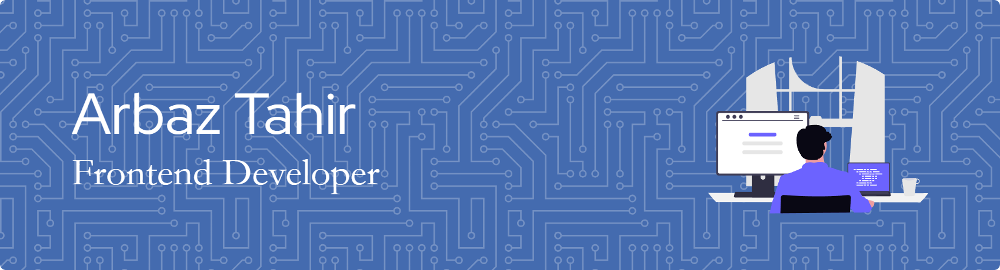

# Hi, I'm Arbaz Tahir 👋
### Frontend Developer · React.js · JavaScript
 

  

   <i>Building responsive, scalable, and user-friendly web interfaces</i>

<!--  -->

---

## 🙋‍♂️ About Me

- 🔭 Currently working on **AI-powered frontend tools** and full-stack projects
- 🌱 Learning **TypeScript**, **Next.js**, and backend development
- 💡 Passionate about clean UI, smooth UX, and writing readable code
- 🤝 Open to **collaborations**, freelance work, and open-source contributions
- 📍 Based in **Jamshedpur, India**

---

## 🛠️ Tech Stack

**Languages & Frameworks**

**Tools & Platforms**

---

## 🚀 Featured Projects

| Project | Description | Tech |
|---|---|---|
| [🌤️ Weather App](https://github.com/Arbaz9234/Weather-App) | Responsive weather app powered by OpenWeatherMap API | JavaScript, API |
| [🔍 Google Clone](https://github.com/Arbaz9234/Google-Clone) | Pixel-perfect Google Search clone | React, JavaScript |
| [🤖 Frontend Tutor Agent](https://github.com/Arbaz9234/frontend-tutor-agent) | Gemini-powered AI agent that generates clean HTML/CSS for beginners | JavaScript, Gemini AI |
| [📋 Kanban Board](https://github.com/Arbaz9234/Kanban-Board) | Fully interactive board with drag-and-drop, optimistic UI & rollback | React 19 |
| [🕯️ Wick & Aura](https://github.com/Arbaz9234/wick-and-aura) | Product showcase for a candle brand | JavaScript |

---

## 📫 Let's Connect

I'm always open to interesting conversations, project ideas, or just a friendly hello.

---

  

